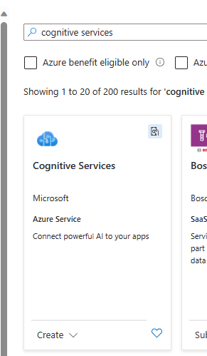
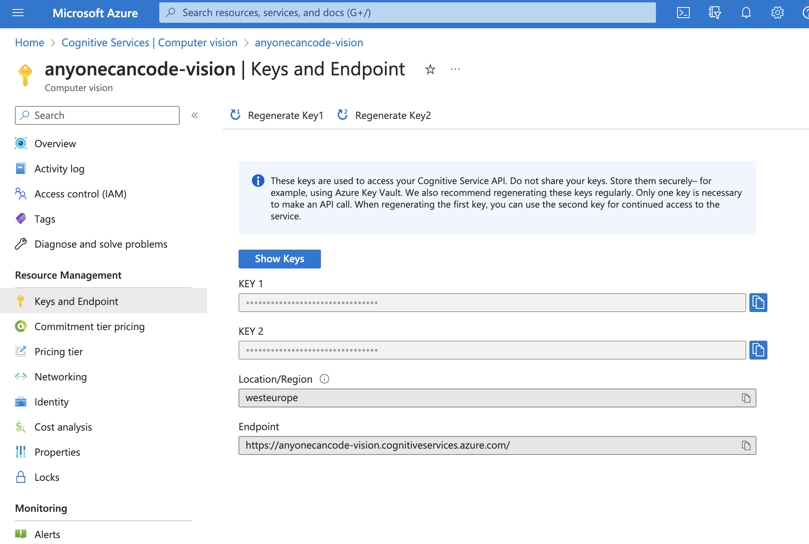

# Challenge 3: Object Recognition

⏲️ _est. time to complete: 30 min._ ⏲️

## Here is what you will learn 🎯

In this challenge you will learn how to:

- Create a Vision API service in Azure
- Connect you Vision API service with your app
- Pass the API key to you app using GitHub Secrets
- Start detecting objects with your app

## Table of contents

### Further informative resources:

- [What is a Resource / Resource Group / Subscription?](https://docs.microsoft.com/azure/cloud-adoption-framework/govern/resource-consistency/resource-access-management)
- [Vision API](https://azure.microsoft.com/en-us/products/cognitive-services/vision-services/)
- [Regions and Availability Zones in Azure](https://docs.microsoft.com/azure/availability-zones/az-overview)
- [GitHub Encrypted secrets](https://docs.GitHub.com/en/actions/reference/encrypted-secrets)

## Getting started

- Navigate to your **Resource Group** we created on Day 1 during the previous challenges.
- Create a new **Resource** and search for **Vision**.
  

## Create Custom Vision Cognitive Service

- Select **Vision** and hit **Create**.
- Your subscription and resource group should already be set. Select **westeurope** as region and **Standard S0**.
  ⚠️ Attention: westeurope is hardcoded - so make sure to have this resource in westeurope
- Give the resource a unique name.
- Hit **Review + create** and than **Create**.
  
- After the resource is created, similar to the challenges on Day 1, copy this time only the key to store it in **GitHub Secrets**

## Integrate Custom Vision Service credentials into GitHub Secret

Again you need to share the information of this resource with the web app, so that it can utilize the Custom Vision service's _intelligence_. Therefore, we will create two more GitHub Secret and share this with the app.

- Navigate to GitHub > Settings > Secrets > Actions and add a `New repository secret`.
- Name: `VITE_VISION_API_KEY`
- Value: The Key of your Custom Vision service you copied before
- Add Secret.

- Navigate to GitHub > Settings > Secrets > Actions and add a `New repository secret`.
- Name: `VITE_VISION_API_ENDPOINT`
- Value: The API endpoint of your Custom Vision service you copied before
- Add Secret.

## Run Frontend Pipeline again

- Navigate to **Actions** > **Pages** and **Run workflow**
  

Click on the frontend link displayed under the deploy step under your pipeline `https://<yourgithubhandle>.github.io/...` or open the app on your phone.

Our frontend application should now have a new button with an image symbol that allows us to detect our object on an image and have our object on the image recognized.

Neither what picture you take nor what is detected will be saved and will **not** appear on the timeline or news feed.

## Look around! What can your app detect? Play around!

So go ahead and detect at least 5 objects and tell us how great your application detects objects on images.

Take also a look at your detected objects or ask other people to compare how well their objects where detected, you might be surprised.

That's a wrap for our 2 days. Congrats!

### Overcharged? We got you covered

Ask your coach if you did not succeed. We have you covered with a back up. ⚠️

### Use prepared Milligram Backend Service

Look at the prepared application with our pictures for you to play around [Milligram](https://microsoft.github.io/anyonecancode/).
